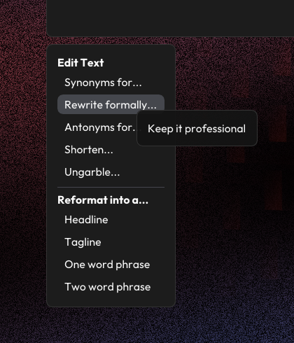
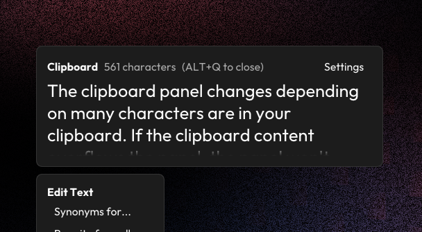
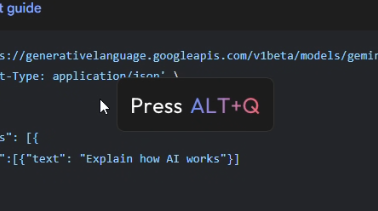

# Design Notes
Here's some of the thinking behind this project.

## Background
This project was originally called "GeminiDesktopConcept" and was originally meant to just be an interface mockup of how you could integrate Gemini into a desktop environment so its always available to use. 

Right from the beginning I wanted to have Google's "Circle to Search" noisy, glittery background in my concept. Initially I was going to do something in Photoshop and then throw the background into Figma, but I decided I wanted to see that background actually animate on my computer, so this project switched from a graphic design thing to a sort of barebones mockup thing that didn't do anything other than look nice. *Then* I decided I wanted this project to be function so it could be something I could use.

## Feature set
As I set out to make this project functional, I knew I didn't want it to just be a chat box. If I wanted that I would just open the consumer Gemini website. Considering I wanted it to be something I would use, I decided to make something for my number one AI use case: gathering some writing suggestions.

Latent Writer includes some of the things I most often ask AI about, helping me rephrase things, shorten long sentences, or generally helping me when I know a sentence doesn't sound right. Doing this in Gemini generates a lot of chat histories, which is annoying, so Latent Writer a nice solution to this, since most of my inquiries are a one off sort of thing.

## Interface
The general vibe takes inspiration from The Browser Company's [Dia concept video](https://x.com/joshm/status/1863580629465788823). I wanted the interface to look like a natural extension of your computer while also looking like something new and shiny. The program being an overlay encompasses this idea. Its part of your computer by always being there, but is also its own thing by drawing itself on top of the desktop and having its own distinct style from what native UI elements usually look like on Windows.

One of the main things you'll be looking at is the "Edit Options" panel. I meant for it to look like a context menu. Modernized but not chunky like the Windows 11 context menu. 

I referenced the Gemini website for colors I could use. I used a muted gray for text that serves as more of a hint. The scrollbar in the suggestions panel uses a light blue since it stands out from the rest of the gray interface.

The clipboard panel changes depending on many characters are in your clipboard. If the clipboard content overflows the panel, the panel won't scroll. I figure you'd be aware of exactly what's in it if you're copying what you need and then opening the overlay. The program is also meant for small text snippets, so overflowing the panel isn't meant to happen very often. Instead, if it does happen, you'll see the last row of text fade out to let you know you have a lot in your clipboard. You'll also see a character count appear just as an extra helpful thing.

## First Run
When you first open Latent Writer, you'll see a prompt telling you how to open the overlay. Its the only place you'll see that uses gradient text. I decided to use it here as a callback to the Gemini website, but also because it stands out as the main thing for you to focus on.

Speaking of the first run prompt, the first run sequence was highly inspired by The Browser Company's Arc Browser. I don't think I've seen another application have such a nice startup sequence. With how nice Latent Writer's shader background ended up looking, I wanted to capture the same feeling. So, instead of it automatically opening, I wanted you press the hotkey with the anticipation of the program doing something, and then being surprised with it doing something a native program wouldn't usually do.

## The Shader
As previously mentioned, the shader background is based on the Google "Circle to Search" background. Back when this project was just "GeminiDesktopConcept," I was thinking the background would cut out in areas the user would select just like in Circle to Search.

Though the final feature set doesn't include this, I kept the background anyway because of how well it fit with what I was thinking as mentioned above. More than anything it just looks really nice!

With Gemini's help, I strung together some of the stuff I've learned about over the years to recreate the effect I was going for.

Random noise for the background. Perlin noise for a random yet organic looking noise distribution that I could use as a mask, that way the desktop below the overlay is more visible. It also gives the overlay a more varied look when animated. Finally, using the same perlin noise, map two colors to it for a gradient look. I animated it at a different speed from the mask to make the overlay look more interesting as it animates over time.
