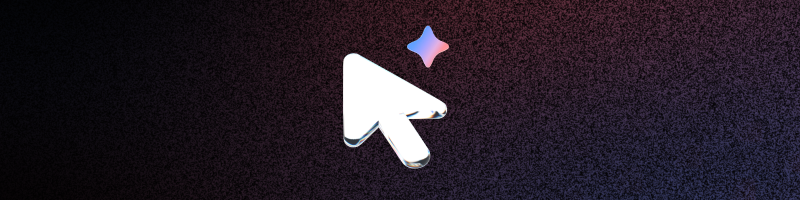

# Latent Writer

A small Windows application meant to help you while you write. Think of it as a "power thesaurus." Summon an overlay which uses your clipboard to generate text suggestions. Uses **Gemini 2.0 Flash** to generate suggestions.

Quickly make text snippets more formal, get synonyms, generate taglines, and more.

This project uses [ocornut/imgui](https://github.com/ocornut/imgui) to create the interface. [glfw](glfw/glfw) and [Dav1dde/glad](https://github.com/Dav1dde/glad) for OpenGL stuff. [cpr](https://github.com/libcpr/cpr) to make http requests and [nlohmann/json](https://github.com/nlohmann/json) to parse them. Outfit font designed by Smartsheet Inc, Rodrigo Fuenzalida. Additional credits to Gemini 2.5 Pro Preview 03-25 for some contributions and general help.

## Setup

Go to the [latest release page](https://github.com/Zyplos/LatentWriter/releases/latest) and look for a **LatentWriter-vX.X-x64.zip** under assets. Download the zip and extract it somewhere you want to keep this program.

You'll need an API Key from Google AI Studio to use this application. You can grab one here: https://aistudio.google.com/app/apikey

Copy the key and launch **LatentWriter.exe**. Hit **ALT+Q**, paste the API key where required, and save settings. Enjoy! Next time you're writing and need some quick suggestions, copy the relevant text snippet and open the overlay to quickly ask Gemini for some suggestions.

https://github.com/user-attachments/assets/b72f672c-42a3-4047-b7e4-a2191a748139

## Project Setup

This project has been configured to work with Visual Studio. It uses vcpkg to download some dependencies and MSBuild to compile code.

Switch the Solution Configuration from Release to Debug to see debug statements get logged to a console window that will launch alongside the application.

`main.cpp` contains the application state along with all the OpenGL setup stuff. `graphics.cpp` contains the shader related code. `gui.cpp` is responsible for creating imgui windows and `geminiAPI.cpp` is responsible for making the API calls to Gemini. It also contains the prompts that get sent to Gemini.

Fonts are stored in `./fonts` and are copied to the output folder as part of the build process.

## Future Stuff

Should I ever come back to this project there are some things I would like to remind myself of:

I should test this on a fancy retina high DPI 360hz 4K monitor whenever I get one.

This program currently uses your clipboard to generate suggestions, but I would have liked for you to have been able to select text and have the program automatically send a CTRL+C keystroke for it to appear in the program. Closing the overlay would restore your original clipboard. Couldn't get it to work, seemed like a Windows security thing.

The Full Desktop Overlay option makes the window alignment stuff behave a little weird if one of your monitors has a different resolution from the rest.

I would've liked to add bloom and other stuff to the shader. `graphics.cpp` would need a rewrite or otherwise it would be too messy.

## Design Notes

You can find some extra notes here if you're wondering about the considerations that went into making Latent Writer: https://github.com/Zyplos/LatentWriter/blob/main/REPORT.md

I also wrote something that is tangentially connected to this project. You can read it here: https://zyplos.dev/ai
