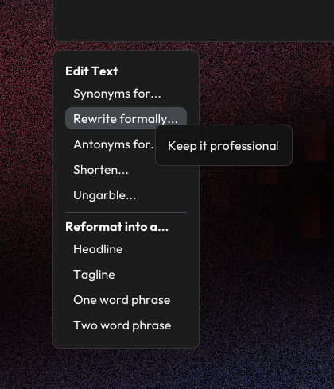
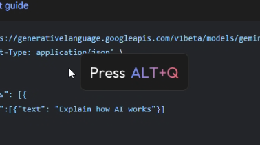

# Project Notes

This project was originally called "GeminiDesktopConcept" was meant to be a UI mockup with the goal of seeing what Gemini could look like if it was integrated into a desktop environment and always ready to use. As I thought about the project more and more, I decided I wanted this to be a real application I could use instead of a simple mockup. With this being AI related, I decided to see how I could streamline one of my biggest use cases for AI: getting writing feedback and suggestions.

Here's some of the thinking behind this project.

## Intro

This project became **Latent Writer**, a writing assistance application that takes the form of an always accessible overlay on top your desktop. 

**The goal** was to have an AI assistant that could take text snippets and give you writing suggestions (synonyms, formalizing text, shortening text, etc) without having a dedicated chat box UI and a clutter of chat histories. These suggestions are meant to be quick, one off queries that you can get in the moment you want them so you don't interrupt your writing flow.

This project was made for one particular **target audience**: me. Even so, its designed to be familiar to any computer user and its meant to be usable by anyone doing writing work on their computer.

Latent Writer was a team effort between Gemini 2.5 Pro Preview 03-25 and I (related post: "[how i use ai](https://zyplos.dev/ai)" talking about this team effort and how I use Latent Writer myself).

https://github.com/user-attachments/assets/b72f672c-42a3-4047-b7e4-a2191a748139

## Process & Methodology

### Feature set
Getting AI suggestions for writing can easily be done on any AI's website with a chat box. Before this project, I would do that, but I always liked to make a new chat so the AI wouldn't use previous text snippets as context for new suggestions I wanted. Annoyingly, that meant I would have a ton of useless chat histories on the sidebar. OpenAI has a temporary chat option, but having to open the site again and again whenever I thought to get suggestions was annoying as well.

Latent Writer addresses these issues by running in the background while you're writing so its easy to summon. The overlay is summoned only though a keystroke, since its meant to be easy to get at right in the moment you want it, which is likely when you're writing so you're already focused on your keyboard. **ALT+Q** was specifically chosen as the keyboard shortcut as it seemed like an easy keystroke to input (such as Discord's CTRL+BACKTICK or Steam's SHIFT+TAB) and I couldn't think of any program that would conflict with this keystroke. 

Latent Writer uses your clipboard to see what text you want suggestions for and includes options for some of the things I most often ask AI about: helping me rephrase things, shorten long sentences, or generally helping me when I know a sentence doesn't sound right. As a nice bonus, the suggestions are shown as a list that you can select, copying the suggestion to your clipboard if you see one that does the job.

### The Background
One of this project's inspirations was Google's "Circle to Search" on Android. I love the noisy, glittery, animated background that gets drawn when that UI is opened. Wanting to see it animate on my own computer was actually the driving force for this becoming a technical project instead of purely just a design project.

With Gemini's help, I strung together some of the stuff I've learned about over the years to recreate the effect I was going for. Random noise for the background. Perlin noise for a random yet organic looking noise distribution that I could use as a mask, that way the shader looked nicely animated as time progressed with the overlay open. It also gives the overlay a more varied look when animated. Finally, using the same perlin noise, map two colors to it for a gradient look. I animated it at a different speed from the mask to make the overlay look more interesting.

### Interface
The general vibe takes inspiration from The Browser Company's [Dia concept video](https://x.com/joshm/status/1863580629465788823). I wanted the interface to look like a natural extension of your computer while also looking like something new and shiny. The program being an overlay encompasses this idea. Its part of your computer by always being there, but is also its own thing by drawing itself on top of the desktop and having its own distinct style from what native UI elements usually look like on Windows.

One of the main things you'll be looking at is the "Edit Options" panel. I meant for it to look like a context menu. Modernized but not chunky like the Windows 11 context menu. This hits that familiarity while also laying out all the options nicely.

I referenced the Gemini website for colors I could use. I used a muted gray for text that serves as more of a hint. The scrollbar in the suggestions panel uses a light blue since it stands out from the rest of the gray interface.

The clipboard panel changes depending on many characters are in your clipboard. If the clipboard content overflows the panel, the panel won't scroll. I figure you'd be aware of exactly what's in it if you're copying what you need and then opening the overlay. The program is also meant for small text snippets, so overflowing the panel isn't meant to happen very often. Instead, if it does happen, you'll see the last row of text fade out to let you know you have a lot in your clipboard. You'll also see a character count appear just as an extra helpful thing.

### First Run
When you first open Latent Writer, you'll see a prompt telling you how to open the overlay. Its the only place you'll see that uses gradient text. I decided to use it here as a callback to the Gemini website, but also because it stands out as the main thing for you to focus on.

The first run sequence was highly inspired by The Browser Company's Arc Browser. I don't think I've seen another application have such an amazing startup sequence. With how nice Latent Writer's shader background ended up looking, I wanted to capture the same feeling. So, instead of it automatically opening, I wanted you press the hotkey with the anticipation of the program doing something, and then being surprised with it doing something a native program wouldn't usually do.

## Iterations

A bit of user testing called for some improvements on what I had initially built. Two main points were addressed: making some actions more explicit and changing how you could interact with the desktop when the overlay was open.

### Better communication
The first run prompt tells the user how to open the overlay by showing what the hotkey to open it is, but that specific hotkey might not stick to someone's mind while they're busy shifting their focus to setting it up (switching their attention to another application for the API Key). The program also explicitly doesn't have a close button in the corner like a typical windows program. 

To address this, some text was added telling the user that ALT+Q would close the overlay. I considered adding this at the bottom of the edit options list as a sort of footer, but opted to have it in the clipboard window so its always shown to the user. I also specifically chose the word "close" since "quit" made it sound like it would close the application entirely.

The empty state for this application (where no text is in the clipboard so suggestions can't be made) shows a bit of text as a placeholder. It previously read:

> Copying text to your clipboard will make it available here.

This was reworded to more explicitly say what the user should do for the program to work and it tells the user what happens if they do. This makes it much more clear that the user needs to specifically copy **text** for Latent Writer to work, as opposed to having them copy image data or file data (or anything that could possibly go in a clipboard).

### Improved interactions

Throughout the development of Latent Writer, the overlay acted as a wall between the application's UI and whatever the user had on their desktop, so the user couldn't interact with windows under the overlay. This to me made it explicit that the overlay was its own thing that didn't interact with your desktop.

Apparently this was annoying, which upon reflection made sense (and thats why user testing, even for my small personal project, is good). Being able to still see your applications under the overlay set some expectation that you'd still be able to use them. This interaction was added, and as a small extra detail, the shader background turns transparent around the user's cursor so they can more clearly see the content under the overlay.

Another interaction change was with how the edit options panel would show up around the desktop. It was really easy for the panel to get cut off if your cursor was around the edges of your screen, so the panels will flip around to make sure the edit options are always visible.

## Technical Implementation

### Stuff used
I gave myself two options: do it in Electron with my bread and butter skills or do it in C++ as a native application where performance would probably be better and have better system integration if needed. I chose native, and although it took me longer to complete the project, I am happy with how Latent Writer turned out.

The interface uses [Dear ImGui](https://github.com/ocornut/imgui) as it was suggested to me by someone who is very knowledgeable of C++ and it seemed like a better option over the more complicated options I looked at. I think its meant to be used in highly dense, debug UIs but I made it look nice. It reminded me a bit of p5 the way its used. Using imgui helped me quickly get the interface going.

*The initial stages of Latent Writer.*

For http request, I used [cpr](https://github.com/libcpr/cpr) mostly because the code looked familiarly easy to use for me. It also seems to take care of async requests with minimal work from me, which was a bonus. Nothing gets blocked, letting the very nice shader background continue to run. [nlohmann/json](https://github.com/nlohmann/json) seemed like a popular option for parsing JSON in C++ and it was easy to work with.

### Learnings & improvements

I would have liked to have had more effects in the shader, such as redrawing the user's cursor with a bloom effect, just as an extra aesthetic thing that looks nice. I would have to break up `graphics.cpp` into more reusable components. I opted to keep it simple only for the sake of time, since getting the shader to look exactly how I wanted took a good bit of time.

I think a more formal AppState class would be useful to have. As it stands passing stuff around everywhere is messy. I was far too into development and kind of just kept building on top of it. But I do recognize this is an area of improvement.

## Summary

I am happy with how this project turned out. It effectively addresses all the pain points I had with my previous experience of getting writing suggestions. Opting for an overlay makes these suggestion as readily available as possible, which is great when your mind is focused on just the writing at hand.

I'm generally just happy with how everything was tied together. I always put attention into every detail to make things look nice, but with Latent Writer I really put explicit intention into every detail and interaction.

I really recommend giving the project and download and seeing it run on your desktop. It just looks so nice!
